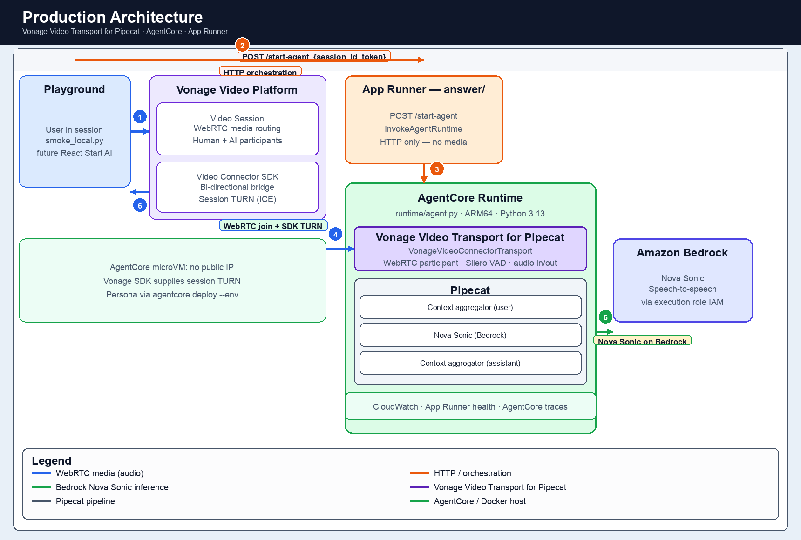

# vonage-pipecat-aws-agentcore

Deploy AI Agent into a Vonage Video Session using **Vonage Video Transport for Pipecat**, **Amazon Nova Sonic**, and **Amazon Bedrock AgentCore Runtime**.

**Status (June 2026):** Milestone complete — full agent on AgentCore + App Runner orchestrator + Playground demo.

---

## Overview

Browser users join a Vonage Video session; the AI agent joins as a native WebRTC participant via **Vonage Video Transport for Pipecat** (`VonageVideoConnectorTransport`), listens and speaks through **Nova Sonic**, and runs in production on **AgentCore Runtime**.

| Component | Role |
| --- | --- |
| **Vonage Video Transport for Pipecat** | Pipecat transport — `VonageVideoConnectorTransport` joins the session as a WebRTC participant |
| **Vonage Video API** | Session management and media routing |
| **Pipecat** | Pipeline orchestration (context aggregators + frame routing) |
| **Amazon Nova Sonic** | Speech-to-speech inference (Bedrock) |
| **Amazon Bedrock AgentCore** | Managed runtime hosting `runtime/agent.py` |

### Architecture

**Production** — `runtime/` on AgentCore + `answer/` on App Runner:



1. User joins a Vonage session in Playground and publishes their mic.
2. `smoke_local.py` (or future React client) calls `POST /start-agent` on App Runner (`answer/`).
3. App Runner invokes AgentCore Runtime (`InvokeAgentRuntime`).
4. **Vonage Video Transport for Pipecat** joins the same session as a WebRTC participant (SDK-managed TURN).
5. **Pipecat** runs the pipeline and invokes **Amazon Nova Sonic on Bedrock** (speech-to-speech via AgentCore execution role).
6. Agent audio is routed back through Vonage to the user.

**Note:** Nova Sonic runs inside the Pipecat pipeline. The AgentCore microVM calls Bedrock via IAM; App Runner only orchestrates — it does not run inference or media.

### Pipecat pipeline

```text
VonageVideoConnectorTransport.input()
  → context aggregator (user)
  → Amazon Nova Sonic (Bedrock)
  → context aggregator (assistant)
  → VonageVideoConnectorTransport.output()
```

Audio: 16 kHz mono in, 24 kHz mono out.

| | **Local** (`app/`) | **Production** (`runtime/` + `answer/`) |
| --- | --- | --- |
| **Host** | FastAPI in Docker on your laptop (`:8000`) | AgentCore Runtime (ARM64) + App Runner orchestrator |
| **Start agent** | Auto-join on startup if `VONAGE_SESSION_ID` is set, or `POST /join` | `POST /start-agent` → `InvokeAgentRuntime` with `action: join` |
| **Session ID** | Static in root `.env` (from C1) | Per request in invoke payload |
| **Vonage token** | Generated inside `app/agent.py` | Passed by client (`smoke_local.py`) or minted by `answer/server.py` / `runtime/agent.py` if omitted |
| **Persona** | Root `.env` → LLM context messages | `agentcore deploy --env` → Nova Sonic `system_instruction` |
| **Bedrock creds** | Developer `AWS_PROFILE` (mounted in Docker) | AgentCore execution role IAM |
| **Pipeline modes** | Nova Sonic only | `nova_sonic` (default) or `echo` (debug) |
| **Orchestration API** | Self-contained — no `answer/` | `GET /`, `POST /start-agent`, `GET /status`, `POST /leave` on App Runner |
| **Local-only extras** | Nova session renewal monitor, Bedrock model validation, `WS /ws` events | `network_probe` action, CloudWatch logging, pipeline lock |

Production invoke payload (via App Runner):

```json
{"action":"join","session_id":"...","token":"...","mode":"nova_sonic"}
```

Use the same `runtimeSessionId` for `status` and `leave` after a join (`answer/server.py` tracks this in memory per App Runner instance).

### AgentCore runtime ARN (required for production)

App Runner must know **which** AgentCore runtime to invoke. Set `AGENTCORE_RUNTIME_ARN` in root `.env` after `agentcore deploy`, **before** `answer/deploy.sh`:

```bash
AGENTCORE_RUNTIME_ARN=arn:aws:bedrock-agentcore:us-east-1:ACCOUNT:runtime/video_agent-...
```

| Where | Needs ARN? |
| --- | --- |
| **AgentCore** (`runtime/`) | No — it is the runtime |
| **App Runner** (`answer/`) | **Yes** — injected by `answer/deploy.sh` from `.env` |
| **`smoke_local.py`** | No — calls App Runner HTTPS; App Runner holds the ARN |

Verify after deploy: `curl` App Runner `/` must return `"runtime_arn_set": true`.

`answer/deploy.sh` reads the ARN from `.env` (sources `.env` first). Resolution order: `AGENTCORE_RUNTIME_ARN` → `C6_AGENTCORE_RUNTIME_ARN` → `AGENTCORE_AGENT_ARN` → hardcoded POC default. If all are unset, it falls back to the validated POC runtime — only use that if you deployed to the same runtime.

### Why this shape

1. **Staged tests (C1–C6)** — prove each layer before integration ([tests/README.md](tests/README.md)).
2. **`app/`** — local dev on your laptop (C1–C4b patterns).
3. **`runtime/`** — full agent in AgentCore.
4. **`answer/`** — thin App Runner orchestrator (`POST /start-agent` → `InvokeAgentRuntime`).
5. **Vonage SDK TURN** — AgentCore microVMs have no public IP; session-dynamic TURN at join.

---

## Repository Layout

```text
tests/      Staged validation C1–C6 — start here
app/        Local integrated agent (dev only)
runtime/    Production agent — AgentCore Runtime
answer/     Production orchestrator — App Runner
client/     Optional — Vonage React Reference App
```

| Concern | Location |
| --- | --- |
| WebRTC + Nova Sonic | `runtime/agent.py` on AgentCore |
| Start agent on demand | `answer/server.py` on App Runner |
| Validate stack layer by layer | [tests/README.md](tests/README.md) |
| Fast local iteration | [app/README.md](app/README.md) |

**Demo path:** C1 → Playground (join existing session) → `answer/smoke_local.py` → nurse triage.

---

## Quick Start

```bash
git clone https://github.com/nexmo-se/vonage-pipecat-aws-agentcore.git
cd vonage-pipecat-aws-agentcore

cp .env.example .env
# VONAGE_APPLICATION_ID, private key, AWS region (us-east-1)

export AWS_PROFILE=vonage-dev
aws sts get-caller-identity --profile vonage-dev
```

**1. Run staged tests** (C1 → C6 in order) — see **[tests/README.md](tests/README.md)** for index, validated results, and workflows.

**2. Local app** (optional, after C1–C4b):

```bash
docker compose --profile app up --build
```

**3. Production deploy** (after C6):

- [`runtime/README.md`](runtime/README.md) — AgentCore
- [`answer/README.md`](answer/README.md) — App Runner orchestrator

---

## Bedrock vs AgentCore

| Layer | Service | In this repo |
| --- | --- | --- |
| Model inference | **Amazon Bedrock** | Nova Sonic speech-to-speech in Pipecat |
| Agent runtime | **Amazon Bedrock AgentCore** | Hosts full agent in `runtime/agent.py` |

- **Local dev:** Bedrock + Pipecat in `app/` (C4b).
- **Production:** entire pipeline in AgentCore + `answer/` for HTTP trigger.

---

## Transport vs Serializer

This repo implements **Transport** (WebRTC session participant):

`Browser ↔ Vonage Video ↔ Video Connector SDK ↔ Pipecat`

**Serializer** (WebSocket / telephony) lives in the companion repo [`vonage-pipecat-serializer-voice-aws-agentcore`](https://github.com/nexmo-se/vonage-pipecat-serializer-voice-aws-agentcore).

Pick **Transport** for in-app video/audio rooms. Pick **Serializer** for telephony-oriented streams.

---

## Production

Deploy two artifacts **in order**:

1. **`runtime/`** → `agentcore deploy` — the agent; copy runtime ARN to `.env` as `AGENTCORE_RUNTIME_ARN`
2. **`answer/`** → `answer/deploy.sh` — orchestrator (reads `AGENTCORE_RUNTIME_ARN` from `.env` into App Runner)

App Runner (validated): `https://x9bqavn3zv.us-east-1.awsapprunner.com`

Validated runtime ARN: `arn:aws:bedrock-agentcore:us-east-1:589536902306:runtime/video_agent-ErxQpSHrDP`

Persona in production — pass at deploy time, not via root `.env` inside the AgentCore container:

- `AGENTCORE_BOOTSTRAP_PROMPT` → system instruction
- `BEDROCK_INITIAL_USER_MESSAGE` → opening line

Optional next steps (React client, Secrets Manager).

---

## AWS credentials and IAM

This project uses **four AWS identities**: your developer profile (tests + deploy), AgentCore **execution role** (Bedrock + ECR in the microVM), App Runner **instance role** (`InvokeAgentRuntime`), and App Runner **access role** (ECR pull).

**Full reference:** [docs/AWS_IAM.md](docs/AWS_IAM.md) — credentials setup, policies by stage (C4a–C6, deploy, production), SCP constraints, and policy JSON templates.

Quick checklist:

| Need | Where |
| --- | --- |
| CLI profile + model access | `AWS_PROFILE`, Bedrock console (Nova Sonic + Nova Lite) |
| Deploy `runtime/` | AgentCore toolkit + `iam:PassRole` + ECR push ([runtime/README.md](runtime/README.md)) |
| **`AGENTCORE_RUNTIME_ARN` in `.env`** | After `agentcore deploy`; required before `answer/deploy.sh` |
| Deploy `answer/` | ECR, IAM roles, App Runner — sets ARN on service ([answer/README.md](answer/README.md)) |
| Run C6 harness / local `answer/server.py` | Developer profile: `bedrock-agentcore:InvokeAgentRuntime` on your runtime ARN |
| Run `smoke_local.py` vs App Runner | HTTPS to App Runner only — ARN lives on the service, not your shell |
| Runtime in AWS | Execution role: Bedrock invoke + ECR pull on `bedrock-agentcore-<agent>` repo |

---

## Prerequisites

| Requirement | Notes |
| --- | --- |
| Python 3.11+ | 3.13 for `runtime/` / C6 |
| Docker | C2–C4b, local `app/` on macOS |
| Vonage Video application | [dashboard.vonage.com](https://dashboard.vonage.com) |
| AWS + Bedrock | Nova Sonic enabled in `us-east-1`; see [docs/AWS_IAM.md](docs/AWS_IAM.md) |

---

## References

**Vonage**

- [Video API overview](https://developer.vonage.com/en/video/overview)
- [Video Connector guide](https://developer.vonage.com/en/video/guides/vonage-video-connector)
- [Pipecat transport guide](https://developer.vonage.com/en/video/guides/vonage-video-connector-pipecat-transport)

**AWS**

- [Bedrock model IDs](https://docs.aws.amazon.com/bedrock/latest/userguide/model-ids.html)
- [Nova Sonic getting started](https://docs.aws.amazon.com/nova/latest/nova2-userguide/sonic-getting-started.html)
- [AgentCore security](https://docs.aws.amazon.com/bedrock-agentcore/latest/devguide/security.html)

---

## License

[MIT](LICENSE) — Copyright © 2026 Vonage API CSE
